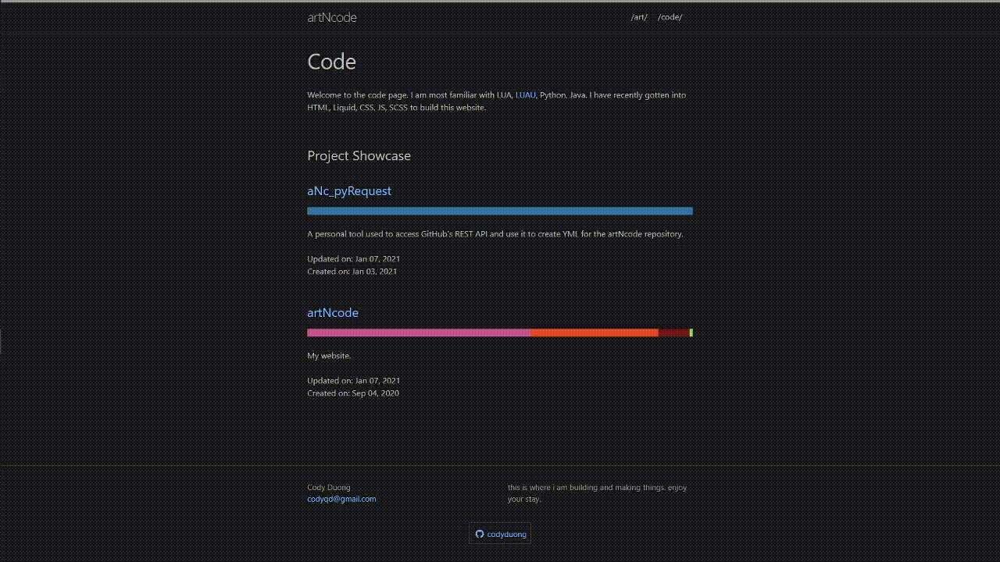

v1.0.3
# What
A python script utilizing requests to access public repos and reformat into a YML file. This YML will then be processed by liquid+HTML or JS.
Recommended for use in conjunction with JS accessing Github Repos actively upon script launch, but if it fails, then will rely on the YML
file generated here.

# Exported Result
```YML
repos:

- name: aNc_pyRequest
  private: False
  permalink: https://github.com/codyduong/aNc_pyRequest
  description: A personal tool used to access GitHub's REST API and use it to create YML for the artNcode repository.
  languages:
    - name: Python
      color: '#3572A5'
      percent: 100.0
  languages_other_percent: 0
  languages_other:
  created: Jan 03, 2021
  updated: Jan 10, 2021

- name: artNcode
  private: False
  permalink: https://github.com/codyduong/artNcode
  apilink: https://api.github.com/repos/codyduong/artNcode
  description: My website.
  languages:
    - name: SCSS
      color: '#c6538c'
      percent: 57.18
    - name: HTML
      color: '#e34c26'
      percent: 33.99
    - name: Ruby
      color: '#701516'
      percent: 7.99
    - name: Shell
      color: '#89e051'
      percent: 0.84
  languages_other_percent: 0
  languages_other:
  created: Sep 04, 2020
  updated: Feb 02, 2021
```

# Utilizing for yourself
Use pipenv to load the dependency file. Or some other management system if you prefer (req. requests)

Simply change the relevant information:
```python
6 | USERNAME = 'codyduong'
7 | MIN_PERCENTAGE_THRESHOLD = 5 #Percentage threshold before the lang is tossed into the other pile
```
For using a personal token, create a token.txt in the same directory as request.py, this step is optional and is not necessary for it to function. It is recommended if you want to access private repos.

The first time you run request.py it will export a whitelist.txt, where you have to set the true/false values for repos you want to export to YML
```
aNc_pyRequest true
artNcode false
...so on and so forth
```

Everytime afterwards it should export any repos marked with true to the YML. If your repos changed, it'll automatically add it to the list and default it to false.

An example of the HTML+Liquid used to parse the YML, taken from here: [artNcode _layouts/code.html](https://github.com/codyduong/artNcode/blob/master/_layouts/code.html)
```HTML
<div class = "flex-container" id = "repoContainer">
      </div>
        
            <div id="{{work.name}}">
              <h1><a href="{{work.permalink}}" title="Github Repository">{{work.name | escape}}</a></h1>
              <div style="width:100%; height: 15px; display: block; white-space: nowrap; font-size: 0px">
                
                  {% if item.percent != '0%' %}
                    <span title="{{item.name}} {{item.percent | append: '%'}}"><div style="background-color: {{item.color | escape}}; height: 100%; width: {{item.percent | append: '%'}}; display: inline-block"></div></span>
                  
                
              </div>
              <br>
              {{work.description}} <br>
              
              <br>
              Updated on: {{work.updated}}<br>
              Created on: {{work.created}}
              <br>
              <br>
              <br>
            </div>
        
      </div>
    </div>
  </div>
```

Here is said HTML in a full website:

